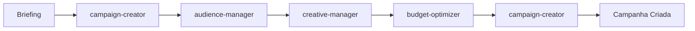

# Arquitetura de Skills - Sistema de Agentes Especializados

Este documento detalha a **arquitetura completa de skills** implementada no projeto, com 8 skills especializadas que trabalham em conjunto para gerenciamento de campanhas publicitárias.

---

## 📋 Visão Geral

O sistema possui **8 skills especializadas** organizadas em uma arquitetura modular:

```
┌─────────────────────────────────────────────────────────┐
│         Ad Campaign Orchestrator                        │
│         (Skill Central de Orquestração)                 │
└───────────┬─────────────────────────────────────────────┘
            │
            ├── Campaign Creator (Criação)
            ├── Campaign Editor (Edição)
            ├── Audience Manager (Audiências)
            ├── Creative Manager (Criativos)
            ├── Budget Optimizer (Orçamento)
            ├── Performance Analyzer (Análise)
            └── Report Generator (Relatórios)
```

---

## 🔧 Skills Disponíveis

### 1. 🎯 Ad Campaign Orchestrator

**Função:** Skill central que coordena todos os outros skills

**Responsabilidades:**
- Rotear requisições para o skill apropriado
- Executar workflows complexos multi-step
- Gerenciar estado entre operações
- Coordenar múltiplos skills em pipelines

**Quando usar:**
```
✅ "Criar campanha completa para produto X"
✅ "Otimizar todas as campanhas"
✅ "Por que o CPA aumentou?"
✅ "Gerar relatório mensal"
```

**Exemplo de orquestração:**
```python
# Usuário: "Criar campanha completa"
orchestrator.route_request(
    "Criar campanha para curso de Python com budget R$ 5000"
)

# Executa pipeline:
# 1. campaign-creator → Estrutura
# 2. audience-manager → Audiências
# 3. creative-manager → Textos
# 4. budget-optimizer → Cálculos
# 5. campaign-creator → Consolidar
```

---

### 2. ✨ Campaign Creator

**Função:** Criação estruturada de novas campanhas do zero

**Responsabilidades:**
- Criar nova campanha baseada em briefing
- Configurar estrutura inicial
- Definir objetivos e settings
- Gerar payloads para APIs

**Plataformas suportadas:**
- Google Ads
- Meta Ads (Facebook/Instagram)
- LinkedIn Ads
- TikTok Ads

**Input típico:**
```yaml
produto: "Curso de Python"
objetivo: "Conversão"
plataforma: "Meta Ads"
budget_mensal: 5000
publico_alvo: "Desenvolvedores iniciantes 25-45 anos"
```

**Output:**
```json
{
  "campaign": {
    "name": "META_CONV_CURSO-PYTHON_DEV-INICIANTES_2024Q1",
    "objective": "OUTCOME_SALES",
    "status": "PAUSED",
    "daily_budget": 166.67
  },
  "ad_sets": [...],
  "ads": [...]
}
```

---

### 3. ✏️ Campaign Editor

**Função:** Edição segura de campanhas existentes

**Responsabilidades:**
- Modificar configurações de campanhas ativas
- Atualizar textos, criativos ou targeting
- Ajustar orçamentos e lances
- Pausar/ativar elementos
- Duplicar campanhas com modificações

**Principais operações:**

#### Edição Simples
```python
# Alterar orçamento diário
editor.update_budget(
    campaign_id="123",
    daily_budget=200
)
```

#### Edição em Lote
```python
# Pausar múltiplas campanhas
editor.bulk_update(
    campaign_ids=["123", "456", "789"],
    status="PAUSED"
)
```

#### Duplicação com Modificações
```python
# Duplicar e modificar
editor.duplicate_campaign(
    source_id="123",
    modifications={
        "name_suffix": "_V2",
        "daily_budget": 150,
        "targeting": new_targeting
    }
)
```

---

### 4. 👥 Audience Manager

**Função:** Gerenciamento de audiências e segmentação

**Responsabilidades:**
- Criar públicos customizados ou lookalike
- Definir segmentação demográfica/comportamental
- Configurar remarketing
- Importar/exportar listas de clientes
- Analisar sobreposição de audiências

**Tipos de audiência:**

#### Custom Audiences
```python
# Website visitors
audience_manager.create_custom_audience(
    name="Website Visitors - Last 30 Days",
    source="WEBSITE",
    retention_days=30,
    pixel_id="123456"
)

# CRM Upload
audience_manager.create_custom_audience(
    name="Customer List",
    source="CRM",
    customer_list="customers.csv"
)
```

#### Lookalike Audiences
```python
# Criar lookalike
audience_manager.create_lookalike(
    source_audience_id="987",
    name="LAL - Customers - 1%",
    country="BR",
    ratio=0.01  # 1% da população
)
```

#### Saved/Detailed Audiences
```python
# Segmentação detalhada
audience_manager.create_detailed_audience(
    name="Devs Python - Brasil",
    targeting={
        "geo_locations": {"countries": ["BR"]},
        "age_min": 25,
        "age_max": 45,
        "interests": ["Python", "Programming", "Web Development"],
        "behaviors": ["Technology early adopters"]
    }
)
```

---

### 5. 🎨 Creative Manager

**Função:** Gerenciamento de criativos publicitários

**Responsabilidades:**
- Criar textos de anúncios otimizados
- Gerar variações de copy
- Especificar requisitos de imagem/vídeo
- Validar criativos contra políticas
- Criar testes A/B

**Templates de copywriting:**

#### AIDA (Attention, Interest, Desire, Action)
```python
creative_manager.generate_copy(
    template="AIDA",
    produto="Curso de Python",
    beneficio_principal="Aprenda em 30 dias",
    cta="Inscreva-se agora"
)

# Output:
# Headline: "🚀 Aprenda Python em 30 Dias!"
# Description: "Do zero ao profissional. Método comprovado..."
# CTA: "Inscreva-se agora"
```

#### PAS (Problem, Agitate, Solve)
```python
creative_manager.generate_copy(
    template="PAS",
    problema="Dificuldade em aprender programação",
    agravamento="Tutoriais confusos online",
    solucao="Curso estruturado passo a passo"
)
```

**Variações para teste A/B:**
```python
# Gerar 5 variações
creative_manager.generate_variations(
    base_copy="Aprenda Python em 30 dias",
    num_variations=5,
    style=["urgency", "benefit", "social_proof"]
)
```

---

### 6. 💰 Budget Optimizer

**Função:** Otimização de orçamentos e estratégias de lance

**Responsabilidades:**
- Recomendar distribuição de budget
- Sugerir estratégias de lance
- Calcular CPA/ROAS alvo
- Ajustar orçamentos baseado em performance
- Simular cenários de investimento

**Cálculos principais:**

#### Budget Mínimo Recomendado
```python
# Meta Ads recomenda 50x CPA alvo por ad set
budget_optimizer.calculate_minimum_budget(
    cpa_target=25,  # R$ 25 por conversão
    num_ad_sets=3
)
# Retorna: R$ 3.750 (50 * 25 * 3)
```

#### Distribuição por Funil
```python
# Dividir budget entre ToFu, MoFu, BoFu
budget_optimizer.distribute_by_funnel(
    total_budget=5000,
    funnel_strategy="balanced"
)
# Retorna:
# ToFu (Awareness): R$ 1.500 (30%)
# MoFu (Consideration): R$ 2.000 (40%)
# BoFu (Conversion): R$ 1.500 (30%)
```

#### Cálculo de CPA/ROAS Alvo
```python
# Baseado em margem e lifetime value
budget_optimizer.calculate_targets(
    product_price=497,
    profit_margin=0.70,  # 70%
    customer_ltv=1200
)
# Retorna:
# max_cpa: R$ 149 (30% do preço)
# min_roas: 3.35x
```

#### Simulação de Cenários
```python
# Simular diferentes budgets
budget_optimizer.simulate_scenarios(
    budgets=[1000, 3000, 5000, 10000],
    historical_data=last_30_days_metrics
)
```

---

### 7. 📊 Performance Analyzer

**Função:** Análise profunda de performance com diagnósticos

**Responsabilidades:**
- Analisar métricas de campanhas
- Identificar problemas de performance
- Comparar períodos ou campanhas
- Detectar anomalias
- Priorizar ações de otimização

**Framework de análise (Hierarquia de diagnóstico):**

```
1. VOLUME
   ├─ Impressions baixas?
   ├─ Alcance limitado?
   └─ Budget insuficiente?

2. QUALIDADE
   ├─ CTR baixo?
   ├─ Relevance Score baixo?
   └─ Creative performance ruim?

3. CONVERSÃO
   ├─ CVR baixo?
   ├─ Landing page ruim?
   └─ Oferta não atrativa?

4. VALOR
   ├─ CPA alto?
   ├─ ROAS baixo?
   └─ AOV baixo?

5. TENDÊNCIA
   ├─ Métricas em queda?
   ├─ Sazonalidade?
   └─ Fadiga de criativo?
```

**Exemplo de análise:**
```python
analyzer.diagnose_campaign(
    campaign_id="123",
    metrics={
        "impressions": 10000,
        "clicks": 50,
        "conversions": 1,
        "spend": 500
    }
)

# Diagnóstico:
# 🔴 CRÍTICO: CTR muito baixo (0.5%)
#    → Causa: Creative não atrativo ou targeting errado
#    → Ação: Testar novos criativos ou revisar audiência
#
# ⚠️ ALERTA: CVR baixo (2%)
#    → Causa: Landing page ou oferta
#    → Ação: A/B test landing page
#
# 📊 INFO: Volume adequado
```

**Detecção de anomalias:**
```python
# Detectar mudanças súbitas
analyzer.detect_anomalies(
    metric="cpa",
    time_series=last_30_days,
    sensitivity=0.8
)

# Retorna:
# Anomalia detectada em 2024-01-15:
# CPA saltou de R$ 25 para R$ 85 (+240%)
# Possível causa: Aumento de concorrência ou mudança no algoritmo
```

---

### 8. 📈 Report Generator

**Função:** Geração automatizada de relatórios

**Responsabilidades:**
- Criar relatórios periódicos (diário, semanal, mensal)
- Gerar dashboards executivos
- Exportar dados em diferentes formatos
- Automatizar envio de relatórios

**Tipos de relatório:**

#### Relatório Executivo (1 página)
```python
report_generator.create_executive_report(
    period="last_month",
    format="PDF",
    include=[
        "spend_summary",
        "key_metrics",
        "top_3_campaigns",
        "recommendations"
    ]
)
```

#### Relatório Operacional (detalhado)
```python
report_generator.create_operational_report(
    period="last_week",
    format="Excel",
    breakdown_by=["campaign", "ad_set", "ad"],
    metrics="all"
)
```

#### Relatório para Cliente
```python
report_generator.create_client_report(
    client_name="Empresa X",
    period="monthly",
    format="PowerPoint",
    branding=True,
    focus="results"  # Foco em resultados, não em detalhes técnicos
)
```

**Formatos suportados:**
- PDF (relatórios visuais)
- Excel (dados brutos)
- Google Sheets (colaborativo)
- PowerPoint (apresentações)
- HTML (web dashboards)
- JSON (integração com sistemas)

---

## 🔄 Workflows Integrados

### Workflow 1: Criar Campanha Completa



**Passos:**
1. **campaign-creator** → Validar briefing e criar estrutura base
2. **audience-manager** → Criar audiências necessárias
3. **creative-manager** → Gerar textos e especificar criativos
4. **budget-optimizer** → Calcular alvos e recomendar budget
5. **campaign-creator** → Consolidar tudo e validar

### Workflow 2: Otimização Semanal

```
1. performance-analyzer → Coletar métricas e diagnosticar
2. budget-optimizer → Recomendar realocações
3. creative-manager → Sugerir novos criativos (se necessário)
4. campaign-editor → Aplicar otimizações
5. report-generator → Gerar relatório de mudanças
```

### Workflow 3: Diagnóstico de Problema

```
1. performance-analyzer → Identificar causa raiz
2. [Skill específico] → Propor correção baseada na causa
   - Se CTR baixo → creative-manager
   - Se CPA alto → budget-optimizer
   - Se audiência pequena → audience-manager
3. campaign-editor → Aplicar correções
4. performance-analyzer → Monitorar resultados
```

### Workflow 4: Reporting Automatizado

```
1. performance-analyzer → Coletar dados e gerar insights
2. report-generator → Formatar e enviar relatório
3. (Opcional) campaign-editor → Aplicar sugestões aprovadas
```

---

## 🚀 Como Usar

### Via Orquestrador (Recomendado)

```
Usuário: "Criar campanha para curso de Python com budget R$ 5000"

→ ad-campaign-orchestrator detecta intenção
→ Executa workflow completo automaticamente
→ Retorna campanha pronta para aprovação
```

### Diretamente (Avançado)

```
Usuário: "@campaign-creator Criar estrutura para campanha de conversão no Google Ads"

→ Invoca skill específica diretamente
→ Útil para operações isoladas
```

---

## 📁 Estrutura de Cada Skill

```
skill-name/
├── SKILL.md              # Documentação principal
├── scripts/              # Scripts Python executáveis
│   ├── main.py          # Script principal
│   ├── validate.py      # Validações
│   └── test.py          # Testes
├── assets/              # Templates, logos, estilos
│   ├── templates/
│   └── styles/
└── references/          # Documentação de referência
    └── api_docs.md
```

---

## 🔌 Integração com Backend

As skills se conectam ao backend FastAPI existente:

```python
# backend/app/api/skills.py

@router.post("/skills/{skill_name}/execute")
async def execute_skill(
    skill_name: str,
    payload: Dict[str, Any]
):
    """Executa uma skill específica"""

    # Carregar skill
    skill = load_skill(skill_name)

    # Executar
    result = await skill.execute(payload)

    return result
```

**Pontos de integração:**
- **APIs**: `backend/app/api/skills.py`
- **Agentes**: `backend/app/agents/skill_executor.py`
- **Meta API**: `backend/app/tools/meta_api.py`

---

## 📝 Nomenclatura e Convenções

### Campanhas
```
[PLATAFORMA]_[OBJETIVO]_[PRODUTO]_[AUDIENCIA]_[DATA]

Exemplos:
- META_CONV_CURSO-PYTHON_REMARKETING_2024Q1
- GOOGLE_TRAFFIC_EBOOK-JS_COLD_2024-01
- LINKEDIN_LEADS_CONSULTORIA_B2B_2024Q1
```

### Arquivos de Output
```
[SKILL]_[ENTITY]_[ACTION]_[TIMESTAMP].json

Exemplos:
- campaign-creator_campaign_payload_20240120.json
- performance-analyzer_diagnosis_report_20240120.json
```

---

## 🔗 Referências Rápidas

| Preciso... | Skill |
|-----------|-------|
| Criar nova campanha | campaign-creator |
| Modificar campanha existente | campaign-editor |
| Criar audiência | audience-manager |
| Escrever anúncios | creative-manager |
| Ajustar orçamento | budget-optimizer |
| Entender performance | performance-analyzer |
| Gerar relatório | report-generator |
| Executar workflow completo | ad-campaign-orchestrator |

---

## 🎓 Diferença entre Skills e Agentes

### Skills (Sistema Atual)
- Ferramentas especializadas
- Executam tarefas específicas
- Podem ser invocadas individualmente
- Orquestradas pelo ad-campaign-orchestrator

### Agentes (Sistema Anterior - docs/backend/)
- Campaign Optimizer Agent
- Budget Advisor Agent
- Performance Analyst Agent

**Relação:**
- Skills são **executores** (fazem a ação)
- Agentes são **consultores** (analisam e recomendam)
- Podem trabalhar juntos: Agente analisa → Skill executa

---

## 📚 Próximos Passos

1. Revisar documentação de cada skill individual
2. Explorar scripts de exemplo em `skills/*/scripts/`
3. Integrar skills com backend existente
4. Testar workflows end-to-end

---

**Localização dos arquivos:** `/Users/guilhermecosta/Projetos/meta/skills/`

**Documentação individual de cada skill disponível em:**
- `skills/ad-campaign-orchestrator/SKILL.md`
- `skills/campaign-creator/SKILL.md`
- `skills/campaign-editor/SKILL.md`
- `skills/audience-manager/SKILL.md`
- `skills/creative-manager/SKILL.md`
- `skills/budget-optimizer/SKILL.md`
- `skills/performance-analyzer/SKILL.md`
- `skills/report-generator/SKILL.md`
